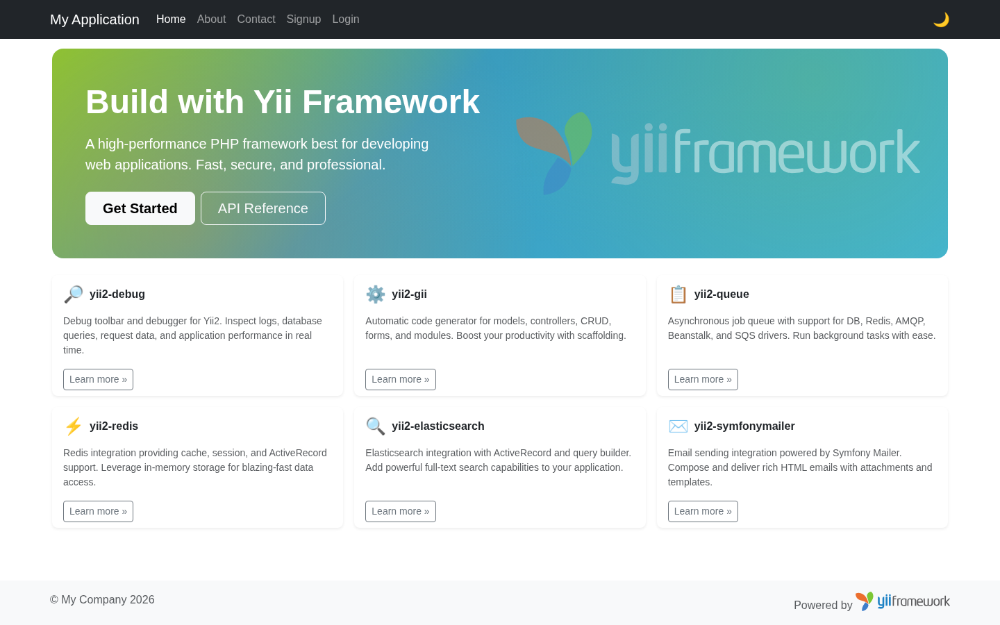
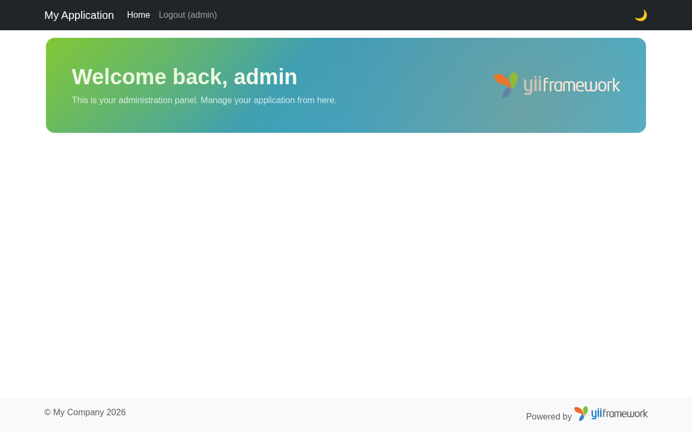

<p align="center">
    <picture>
        <source media="(prefers-color-scheme: dark)" srcset="https://www.yiiframework.com/image/design/logo/yii3_full_for_dark.svg">
        <source media="(prefers-color-scheme: light)" srcset="https://www.yiiframework.com/image/design/logo/yii3_full_for_light.svg">
        
    </picture>
    <h1 align="center">Yii 2 Advanced Project Template</h1>
    <br>
</p>

Yii 2 Advanced Project Template is a skeleton [Yii 2](https://www.yiiframework.com/) application best for
developing complex Web applications with multiple tiers.

The template includes three tiers: front end, back end, and console, each of which
is a separate Yii application.

The template is designed to work in a team development environment. It supports
deploying the application in different environments.

Documentation is at [docs/guide/README.md](docs/guide/README.md).

[](https://packagist.org/packages/yiisoft/yii2-app-advanced)
[](https://packagist.org/packages/yiisoft/yii2-app-advanced)
[](https://github.com/yiisoft/yii2-app-advanced/actions?query=workflow%3Abuild)
[](https://github.com/yiisoft/yii2-app-advanced/actions/workflows/static.yml)

## Docker

[](https://github.com/yiisoft/yii2-app-advanced/actions/workflows/docker.yml)

REQUIREMENTS
------------

> [!IMPORTANT]
> - The minimum required [PHP](https://www.php.net/) version of Yii is PHP `8.2`.

## Install via Composer

If you do not have [Composer](https://getcomposer.org/), you may install it by following the instructions
at [getcomposer.org](https://getcomposer.org/doc/00-intro.md#installation-nix).

You can then install this project template using the following commands:

```bash
composer create-project --prefer-dist yiisoft/yii2-app-advanced advanced
cd advanced
```

### Frontend

<picture>
    <source media="(prefers-color-scheme: dark)" srcset="docs/images/frontend/home-dark.png">
    <source media="(prefers-color-scheme: light)" srcset="docs/images/frontend/home-light.png">
    
</picture>

### Backend

<picture>
    <source media="(prefers-color-scheme: dark)" srcset="docs/images/backend/home-dark.png">
    <source media="(prefers-color-scheme: light)" srcset="docs/images/backend/home-light.png">
    
</picture>

DIRECTORY STRUCTURE
-------------------

```
common
    config/              contains shared configurations
    mail/                contains view files for e-mails
    models/              contains model classes used in both backend and frontend
    tests/               contains tests for common classes
console
    config/              contains console configurations
    controllers/         contains console controllers (commands)
    migrations/          contains database migrations
    models/              contains console-specific model classes
    runtime/             contains files generated during runtime
backend
    assets/              contains application assets such as JavaScript and CSS
    config/              contains backend configurations
    controllers/         contains Web controller classes
    models/              contains backend-specific model classes
    runtime/             contains files generated during runtime
    tests/               contains tests for backend application
    views/               contains view files for the Web application
    web/                 contains the entry script and Web resources
frontend
    assets/              contains application assets such as JavaScript and CSS
    config/              contains frontend configurations
    controllers/         contains Web controller classes
    models/              contains frontend-specific model classes
    runtime/             contains files generated during runtime
    tests/               contains tests for frontend application
    views/               contains view files for the Web application
    web/                 contains the entry script and Web resources
    widgets/             contains frontend widgets
vendor/                  contains dependent 3rd-party packages
environments/            contains environment-based overrides
```

Initialize the application for the `Development` environment:

```bash
php init --env=Development --overwrite=All
```

Now you should be able to access the application through the following URLs, assuming `advanced` is the directory
directly under the Web root.

```
http://localhost/advanced/frontend/web/
http://localhost/advanced/backend/web/
```

## Install with Docker

Build and start the containers:

```bash
docker compose up -d --build
```

Install dependencies inside the container:

```bash
docker compose exec frontend composer update --prefer-dist --no-interaction
```

Initialize the application for the `Development` environment:

```bash
docker compose exec frontend php /app/init --env=Development --overwrite=All
```

After running `init`, update the database connection in `common/config/main-local.php` to use the `mysql`
service hostname:

```php
'db' => [
    'class' => \yii\db\Connection::class,
    'dsn' => 'mysql:host=mysql;dbname=yii2advanced',
    'username' => 'yii2advanced',
    'password' => 'secret',
    'charset' => 'utf8',
],
```

You can then access the application through the following URLs:

```
http://127.0.0.1:20080  (frontend)
http://127.0.0.1:21080  (backend)
```

To run the test suite, also update `common/config/test-local.php` to use the `mysql` hostname and create the
test database:

```php
'db' => [
    'dsn' => 'mysql:host=mysql;dbname=yii2advanced_test',
],
```

```bash
docker compose exec -T mysql mysql -uroot -pverysecret -e "CREATE DATABASE IF NOT EXISTS yii2advanced_test; GRANT ALL PRIVILEGES ON yii2advanced_test.* TO 'yii2advanced'@'%'; FLUSH PRIVILEGES;"
docker compose exec -T frontend php /app/yii_test migrate --interactive=0
docker compose exec -T frontend vendor/bin/codecept build
docker compose exec -T frontend vendor/bin/codecept run
```

**NOTES:**
- Minimum required Docker engine version `17.04` for development (see [Performance tuning for volume mounts](https://docs.docker.com/docker-for-mac/osxfs-caching/))
- The default configuration uses a host-volume in your home directory `~/.composer-docker/cache` for Composer caches

CONFIGURATION
-------------

## Database

Edit the file `common/config/main-local.php` with real data, for example:

```php
return [
    'components' => [
        'db' => [
            'class' => \yii\db\Connection::class,
            'dsn' => 'mysql:host=localhost;dbname=yii2advanced',
            'username' => 'root',
            'password' => '1234',
            'charset' => 'utf8',
        ],
    ],
];
```

When using Docker, the MySQL service is pre-configured. Update `common/config/main-local.php` to use:

```php
'db' => [
    'class' => \yii\db\Connection::class,
    'dsn' => 'mysql:host=mysql;dbname=yii2advanced',
    'username' => 'yii2advanced',
    'password' => 'secret',
    'charset' => 'utf8',
],
```

Apply migrations:

```bash
php yii migrate
```

Or with Docker:

```bash
docker compose exec frontend php /app/yii migrate
```

**NOTES:**
- Yii won't create the database for you, this has to be done manually before you can access it.
  When using Docker, the MySQL service creates the database automatically.
- Check and edit the other files in the `config/` directories to customize your application as required.
- Refer to the README in the `tests` directory for information specific to application tests.

TESTING
-------

Tests are located in `frontend/tests`, `backend/tests`, and `common/tests` directories.
They are developed with [Codeception PHP Testing Framework](https://codeception.com/).

Tests can be executed by running:

```bash
vendor/bin/codecept run --env php-builtin
```

Or using the Composer script:

```bash
composer tests
```

## Support the project

[](https://opencollective.com/yiisoft)

## Follow updates

[](https://www.yiiframework.com/)
[](https://x.com/yiiframework)
[](https://t.me/yii_framework_in_english)
[](https://yiiframework.com/go/slack)

## License

[](LICENSE.md)
