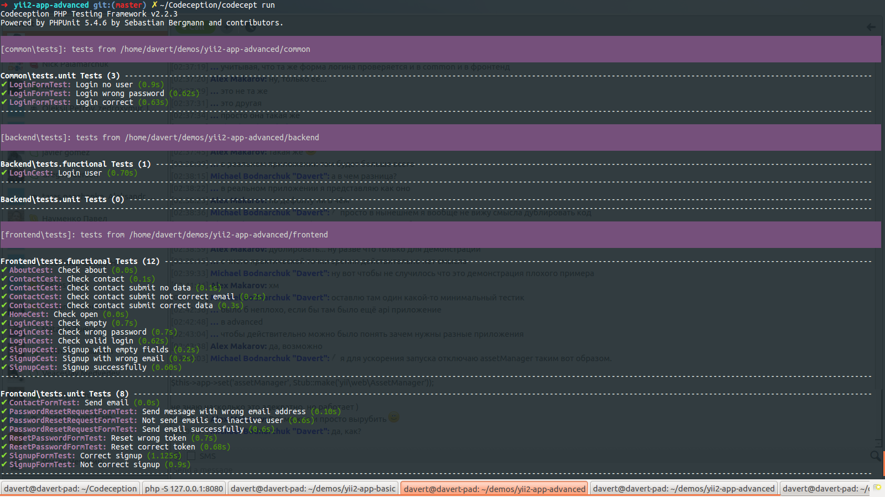

テスト
======

Yii2 アドバンストアプリケーションは Codeception を主たるテストフレームワークとして使用します。
`frontend`、`backend` および `common` の `tests` ディレクトリに、既にいくつかのサンプルテストが用意されています。
テストには、テストを実行するたびに事前にクリーンアップされる **追加のデータベース** が必要になります。
(`common/config/test.php` の構成に従って) mysql に `yii2advanced_test` というデータベースを作成し、下記を実行して下さい。

```
./yii_test migrate
```

次に、テストスイートをビルドします。

```
composer exec codecept build
```

これで、次のコマンドを実行すれば、全てのサンプルテストを開始することが出来ます。

```
composer exec codecept run
```

次の図と同じような出力が得られる筈です。



あなたのテストを最新の状態に保つことが推奨されます。
クラスまたは機能が削除されたときには、対応するテストも削除されるべきです。
テストは定期的に実行すべきです。あるいは、もっと良い方法として、継続インテグレーションサーバをテストのためにセットアップしましょう。

Codeception をあなたのアプリケーションのために構成する方法を学ぶために [Yii2 Framework Case Study](http://codeception.com/for/yii) を参照して下さい。

### Common

共通クラスのためのテストは `common/tests` にあります。このテンプレートでは、単体テスト (`unit` テスト) しか有りません。
下記を実行してテストを実行します。

```
composer exec codecept run -- -c common 
```

`-c` オプションが `codeception.yml` 構成ファイルへのパスをセットすることを可能にしています。

単体テスト (`unit` テスト) スイート (`common/tests/unit` にあります) では、Yii フレームワークの機能、例えば、`Yii::$app`、アクティブレコード、フィクスチャなどを使用することが出来ます。
このことが可能なのは、テストの構成 `common/tests/unit.suite.yml` において `Yii2` モジュールが有効になっているからです。
これを無効すると、テストを完全に独立した状態で走らせることが出来ます。


### Frontend

フロントエンドのテストは、単体テスト、機能テスト、受入テストを含んでいます。
下記を実行してテストを実行します。

```
composer exec codecept run -- -c frontend
```

テストスイートの説明

* 単体 (`unit`) ⇒ フロントエンドアプリケーションだけに関係する諸クラスのテスト
* 機能 (`functional`) ⇒ アプリケーションの内部的なリクエストとレスポンスのテスト (ウェブサーバ抜きで)
* 受入 (`acceptance`) ⇒ 実際のブラウザにおけるWebアプリケーション、ユーザインタフェイス、javascript 相互作用のテスト

デフォルトでは、受入テストは無効になっています。受入テストを実行するためには、次のようにします。

#### 受入テストを実行する

受入テストを実行するためには、次のようにします。

1. `frontend/tests/acceptance.suite.yml.example` を `frontend/tests/acceptance.suite.yml` にリネームして、スイートの構成を有効にする

2. `composer.json` の `codeception/base` パッケージを `codeception/codeception` に置き換えて、全ての機能をもつ Codeception のバージョンをインストールする

3. Composer で依存を更新する

    ```
    composer update  
    ```

4. [Selenium Server](http://www.seleniumhq.org/download/) をダウンロードして起動する

    ```
    java -jar ~/selenium-server-standalone-x.xx.x.jar
    ``` 

5. ウェブサーバを開始する

    ```
    php -S 127.0.0.1:8080 -t frontend/web
    ```

6. これで全てのテストを実行することが出来る

   ```
   composer exec codecept run acceptance -- -c frontend
   ```

## Backend

バックエンドアプリケーションは、単体テストと機能テストのスイートを含んでいます。
下記によって、テストスイートを実行します。

```
composer exec codecept run -- -c backend 
```